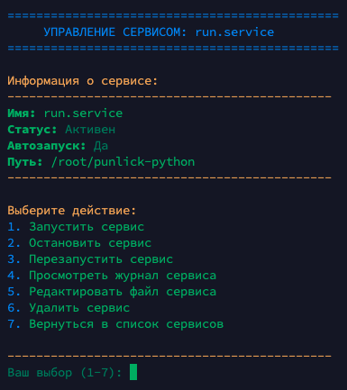

# Менеджер Systemd-сервисов


Скрипт для удобного создания и управления системными сервисами Linux через интерфейс в терминале. Позволяет быстро создавать сервисы systemd для Python-скриптов и управлять ими без необходимости вручную редактировать конфигурационные файлы.

## Особенности

- 🚀 **Быстрое создание сервисов** - создание сервиса systemd в несколько кликов
- 🔄 **Полное управление сервисами** - запуск, остановка, перезапуск
- 📝 **Просмотр логов** - удобный просмотр журналов работающего сервиса
- 🔧 **Редактирование конфигурации** - изменение параметров сервиса через встроенный редактор
- 🔍 **Мониторинг состояния** - отслеживание статуса всех созданных сервисов
- 🛡️ **Безопасное удаление** - корректное удаление сервисов с подтверждением
- ⚡ **Поддержка разных окружений** - запуск через чистый Python, UV-менеджер, Poetry, PHP-сервер, Shell-скрипты
- 📣 **Расширенные уведомления** - настройка уведомлений в Telegram с информацией о статусе сервисов, отправкой логов и отслеживанием событий с серверов

## Требования

- Linux с systemd (например, Ubuntu, CentOS, Debian)
- Bash
- Права суперпользователя (sudo)
- Python3 и/или UV менеджер и/или Poetry и/или PHP и/или Bash (в зависимости от выбранного режима запуска)
- Любой текстовый редактор (vim, vi)
- Интернет-соединение для отправки уведомлений (при использовании соответствующей функции)

## Установка

Вы можете скачать скрипт напрямую из репозитория:

```bash
curl -o service.sh https://raw.githubusercontent.com/darkClaw921/services-create-curl/master/service.sh
chmod +x service.sh
```

Или клонировать весь репозиторий:

```bash
git clone https://github.com/darkClaw921/services-create-curl.git
cd services-create-curl
chmod +x service.sh
```

### Быстрый запуск без скачивания

Вы также можете запустить скрипт одной командой без необходимости сохранять его на диск:

```bash
bash <(curl -sSL https://raw.githubusercontent.com/darkClaw921/services-create-curl/master/service.sh) <(echo)
```

> ⚠️ **Внимание**: Эта команда загружает и выполняет скрипт напрямую. Всегда проверяйте скрипты из интернета перед их выполнением с правами суперпользователя!

## Использование

### Запуск скрипта

```bash
sudo ./service.sh
```

> ⚠️ **Внимание**: Для работы скрипта требуются права суперпользователя!

### Главное меню

После запуска вы увидите главное меню с четырьмя опциями:

1. **Создать новый сервис** - создание нового systemd-сервиса
2. **Просмотреть и управлять существующими сервисами** - просмотр и управление сервисами
3. **Менеджер уведомлений** - настройка уведомлений о статусе сервисов
4. **Завершить работу скрипта** - выход из программы

### Создание нового сервиса

1. В главном меню выберите "Создать новый сервис"
2. Выберите режим запуска:
   - "Чистый Python" для запуска через python3
   - "UV менеджер" для запуска через uv run
   - "Poetry" для запуска через poetry run python
   - "PHP сервер" для запуска PHP-файла на указанном порту
   - "Shell скрипт" для запуска bash/sh скриптов
3. Выберите файл из текущей директории, для которого нужно создать сервис
4. Введите описание сервиса
5. Скрипт создаст systemd-сервис и предложит запустить его

### Управление сервисами




1. В главном меню выберите "Просмотреть и управлять существующими сервисами"
2. Выберите сервис из списка для управления
3. Выберите нужное действие из меню управления сервисом:
   - **Запуск сервиса** - запуск остановленного сервиса
   - **Остановка сервиса** - остановка работающего сервиса
   - **Перезапуск сервиса** - перезапуск сервиса
   - **Просмотр журнала сервиса** - просмотр логов сервиса
   - **Редактирование файла сервиса** - изменение параметров сервиса
   - **Удаление сервиса** - удаление сервиса из системы
   - **Возврат в список сервисов** - возврат к списку всех сервисов

### Просмотр журналов

При выборе опции "Просмотр журнала сервиса" вы можете:

1. Просмотреть последние 50 строк журнала
2. Просмотреть полный журнал сервиса
3. Наблюдать за журналом в реальном времени

### Настройка уведомлений через Telegram

1. Запустите скрипт `sudo ./service.sh`
2. Выберите "Менеджер уведомлений"
3. Включите уведомления через пункт "Включить/выключить уведомления"
4. Настройте Telegram Chat ID, следуя инструкции в меню:
   - Добавьте бота @userinfobot в Telegram
   - Отправьте боту сообщение /start
   - Скопируйте полученный ID и вставьте его в соответствующее поле
5. Протестируйте отправку уведомлений через пункт "Протестировать отправку уведомления"

После настройки уведомлений вы будете получать информативные сообщения в Telegram при изменении статуса любого сервиса:

- **✅ Запуск сервиса** - уведомление при успешном запуске
- **🛑 Остановка сервиса** - уведомление при остановке сервиса
- **🔄 Перезапуск сервиса** - уведомление при перезапуске сервиса

Каждое уведомление содержит:
- Имя сервиса и его текущий статус
- IP-адрес сервера, с которого пришло уведомление
- Имя пользователя, от имени которого запущен сервис
- Текущие дату и время события
- Файл с последними 50 строками логов сервиса

Это позволяет оперативно отслеживать состояние сервисов на всех ваших серверах и быстро реагировать на возникающие проблемы.

## Примеры использования

### Создание сервиса для Python-скрипта

1. Подготовьте ваш Python-скрипт (`script.py`) в нужной директории
2. Запустите скрипт `sudo ./service.sh`
3. Выберите "Создать новый сервис"
4. Выберите "Чистый Python"
5. Выберите ваш файл `script.py`
6. Введите описание (например, "Мой тестовый сервис")
7. Выберите "y" для запуска сервиса сразу

### Создание сервиса для PHP-файла на определенном порту

1. Подготовьте ваш PHP-файл (`index.php`) в нужной директории
2. Запустите скрипт `sudo ./service.sh`
3. Выберите "Создать новый сервис"
4. Выберите "PHP сервер"
5. Введите хост и порт (например, "localhost:8080")
6. Выберите ваш файл `index.php`
7. Введите описание (например, "Мой PHP-сервис")
8. Выберите "y" для запуска сервиса сразу

### Мониторинг логов сервиса

1. Запустите скрипт `sudo ./service.sh`
2. Выберите "Просмотреть и управлять существующими сервисами"
3. Выберите нужный сервис из списка
4. Выберите "Просмотр журнала сервиса"
5. Выберите "Наблюдать за журналом в реальном времени"

### Создание сервиса для Shell-скрипта

1. Подготовьте ваш shell-скрипт (`script.sh`) в нужной директории
2. Убедитесь что скрипт имеет права на выполнение: `chmod +x script.sh`
3. Запустите скрипт `sudo ./service.sh`
4. Выберите "Создать новый сервис"
5. Выберите "Shell скрипт"
6. Выберите ваш файл `script.sh`
7. Введите описание (например, "Мой shell-скрипт")
8. Выберите "y" для запуска сервиса сразу

### Быстрое создание сервиса из GitHub-репозитория

Вы можете клонировать репозиторий и сразу создать сервис для содержащегося в нем скрипта:

```bash
# Клонируем репозиторий
git clone https://github.com/darkClaw921/services-create-curl.git
cd services-create-curl

# Выбираем нужные опции и создаем сервис
```

## Структура скрипта

- **Создание сервисов**
  - Автоматическое определение пути к исполняемым файлам
  - Создание конфигурационного файла systemd
  - Активация сервиса для автозапуска

- **Управление сервисами**
  - Запуск, остановка и перезапуск
  - Просмотр журналов (логов)
  - Редактирование конфигурации
  - Удаление сервисов

- **Пользовательский интерфейс**
  - Цветной интерфейс для удобства использования
  - Навигация по меню
  - Информативные сообщения и подсказки

## Дополнительная информация

- Скрипт хранит список созданных сервисов в файле `/var/lib/service-creator/created_services.list`
- Файлы сервисов создаются в директории `/etc/systemd/system/`
- При создании сервиса скрипт автоматически устанавливает рабочую директорию на папку, из которой был запущен скрипт

## Устранение неполадок

- **Ошибка "Команда не найдена"** - убедитесь, что Python3 или UV установлены в системе
- **Ошибка при запуске сервиса** - проверьте журнал сервиса для получения деталей проблемы
- **Сервис не запускается автоматически** - проверьте статус с помощью `systemctl status имя_сервиса`
- **bash: /dev/fd/63: No such file or directory** - запустите скритп иным способом
```bash
curl -sSL https://raw.githubusercontent.com/darkClaw921/services-create-curl/master/service.sh -o service.sh
chmod +x service.sh
sudo ./service.sh
```
или
```bash
curl -sSL https://raw.githubusercontent.com/darkClaw921/services-create-curl/master/service.sh | sudo bash
```

## Лицензия

Данный скрипт распространяется под лицензией MIT.

## Автор

Если у вас есть вопросы или предложения, свяжитесь со мной:
